# Testownik AI —  (FastAPI + RAG)

Backend do aplikacji „Testownik AI”.  
Z wgranych materiałów **PDF / PPTX / DOCX / EPUB** buduje bazę wiedzy, a następnie generuje:

- pytania **TAK/NIE**,
- pytania **ABCD (MCQ)**

z **poprawną odpowiedzią, wyjaśnieniem** oraz **cytowaniem źródeł** (plik + strona/slajd + krótki cytat).

---
## 0. zrób .env
przyklad:
APP_HOST=127.0.0.1
APP_PORT=8000
EMB_MODEL=sentence-transformers/all-MiniLM-L6-v2
LLM_PROVIDER=ollama            # openai|ollama|none
OPENAI_API_KEY=sk-...
OLLAMA_BASE_URL=http://127.0.0.1:11434


## 1. Instalacja i uruchomienie

Wymagania: Python 3.11+.

```bash
pip install -r requirements.txt
fastapi dev apps/api/main.py
```
Domyślne adresy:
- API: http://127.0.0.1:8000
- Swagger UI: http://127.0.0.1:8000/docs

## 2. Format odpowiedzi (przykład)
```json
{
  "question_id": "a8c856ef-3aae-4251-90df-e3aa58ca84d8",
  "question": {
    "kind": "MCQ",
    "stem": "Które stwierdzenie wynika z materiału? ...",
    "options": ["a) ...", "b) ...", "c) ...", "d) ..."],
    "answer": "a",
    "explanation": "Uzasadnienie oparte na cytowanych fragmentach.",
    "metadata": {
      "topic": "general",
      "difficulty": "medium",
      "timestamp": "2025-10-25T13:04:31.001193Z"
    },
    "citations": [
      {
        "source": "SP-W03.pdf",
        "page": 48,
        "quote": "Analogicznie wygląda przykład w MicroPython"
      }
    ]
  }
}
```
Dla pytań TAK/NIE (kind: "YN") w polu options jest null, a answer przyjmuje wartości "TAK" lub "NIE"

## 3. Endpointy (skrót)

| Method | Path       | Body (JSON / multipart)                                       | Opis                                                 |
| ------ | ---------- | ------------------------------------------------------------- | ---------------------------------------------------- |
| POST   | `/upload`  | `files=@plik` (multipart, można wysłać wiele plików)          | Indeksacja materiałów **PDF/PPTX/DOCX/EPUB**.        |
| POST   | `/search`  | `{ "query": "...", "k": 8 }`                                  | Wyszukiwanie fragmentów (RAG) z cytowaniami.         |
| POST   | `/gen/yn`  | `{ "topic": "...", "difficulty": "easy\|medium\|hard" }`      | Pytanie **TAK/NIE** + wyjaśnienie + cytowania.       |
| POST   | `/gen/mcq` | `{ "topic": "...", "difficulty": "easy\|medium\|hard" }`      | Pytanie **ABCD** + poprawna odpowiedź + wyjaśnienie. |
| POST   | `/rate`    | `{ "question_id": "...", "score": 1..10, "feedback": "..." }` | Ocena jakości pytania (uczenie się na feedbacku).    |

Typowe użycie frontend:
-  Wysyła materiały przez /upload.
- Woła /gen/mcq lub /gen/yn dla wybranego tematu.
- Wyświetla wygenerowane pytanie + wyjaśnienie + źródła.
- Po rozwiązaniu pytania woła /rate, żeby zapisać ocenę.
## 4. Konfiguracja LLM (ENV)

Backend może działać:
- w trybie **offline** (`LLM_PROVIDER=none`) – pytania generowane prostym fallbackiem,
- z modelem **OpenAI** (`LLM_PROVIDER=openai`, `OPENAI_API_KEY=...`),
- z lokalnym **Ollama** (`LLM_PROVIDER=ollama`, `OLLAMA_BASE_URL=...`).

Frontend nie musi tego konfigurować – ważne jest tylko, że:
- jeśli LLM działa, pytania są „mądre” i oparte na kontekście,
- jeśli nie, backend nadal zwróci poprawny JSON, tylko prostsze pytania.

## 5. Struktura danych (lokalnie)
```
data/
  sources/   # wgrane materiały (PDF, PPTX, DOCX, EPUB)
  index/     # plik bazy SQLite + embeddingi
```
- Tabela sources – informacje o plikach (nazwa, typ MIME, liczba stron/slajdów).
- Tabela chunks – tekst pocięty na fragmenty (chunki) + embeddingi.
- Tabela questions – wygenerowane pytania, odpowiedzi, wyjaśnienia, metadane.
- Tabela question_citations – powiązanie pytania z konkretnymi plikami/stronami.
- Tabela ratings – oceny użytkowników.
- Tabela chunk_weights – wagi chunków, wpływające na przyszłe wyszukiwanie (RAG).
## 6. Przepływ danych (od PDF do pytania)

### Skrót słowny

1. Upload materiału  
   Frontend wysyła pliki na `/upload`. FastAPI zapisuje je w `data/sources/`.

2. Ingest (budowa bazy wiedzy)  
   Funkcja `ingest_files(...)`:
   - sprawdza typ pliku (`_detect_mime`),
   - czyta tekst stron/slajdów (`_read_pdf/_read_pptx/_read_docx/_read_epub`),
   - tnie tekst na chunki (`chunk_text`),
   - liczy embeddingi dla każdego chunku (`embed_texts`),
   - zapisuje wszystko w SQLite (`sources`, `chunks`).

3. RAG – wybór kontekstu  
   Przy wywołaniu `/gen/mcq` lub `/gen/yn`:
   - `rag_search(...)` wczytuje embeddingi z bazy (`_load`),
   - embeduje treść zapytania (`embed_query`),
   - wybiera `top_k` najbardziej pasujących chunków
     (z uwzględnieniem wag `chunk_weights`),
   - składa kontekst w jeden tekst + listę cytatów (`_flatten_ctx`).

4. Generowanie pytania (LLM)  
   - `gen_mcq(...)` / `gen_yes_no(...)` budują prompt z kontekstem i poziomem trudności,  
   - `ask_llm(...)` wysyła go do wybranego LLM; odpowiedź (JSON) parsujemy do `question_object`.

5. Zapis i odpowiedź  
   - `save_question_with_citations(...)` zapisuje pytanie i źródła w bazie,  
   - endpoint zwraca JSON `{question_id, question}` do frontendu.

6. Ocena pytań (feedback loop)  
   - `/rate` zapisuje oceny w `ratings`  
   - aktualizuje `chunk_weights`, żeby kolejne pytania lepiej korzystały z materiałów.

```mermaid
flowchart TB

  %% --- Ingest ---
  subgraph ING ["Etap A: Ingest materiałów"]
    direction TB
    U["Upload pliku PDF (frontend)<br/>Dane: plik PDF (binarny)"]
    A1["Endpoint /upload (FastAPI)<br/>Dane: multipart/form-data z plikiem"]
    A2["Zapis pliku na dysk (settings.src_dir)<br/>Dane: file_path (string)"]
    A3["ingest_files(file_paths, database_path, index_directory, embedding_model_name)<br/>Wejście: lista ścieżek plików"]
    A31["_detect_mime(file_path)<br/>Dane: file_path → mime_type (string)"]
    A32["_read_pdf / _read_pptx / _read_docx / _read_epub<br/>Dane: lista (page_number, full_page_text)"]
    A33["chunk_text(full_page_text)<br/>Dane: chunki (source_id, page_number, chunk_text, short_quote)"]
    A34["embed_texts(list_of_chunk_texts)<br/>Dane: embeddingi (384D) → BLOB"]
    A35["SQLite: INSERT INTO sources oraz chunks<br/>Dane: rekordy w bazie"]

    U --> A1 --> A2 --> A3 --> A31 --> A32 --> A33 --> A34 --> A35
  end

  %% --- RAG + LLM ---
  subgraph GEN ["Etap B: Pytanie"]
    direction TB
    B1["POST /gen/mcq lub /gen/yn (frontend)<br/>Dane: JSON {topic_text, difficulty_level}"]
    B2["rag_search(question_text, top_k, database_path)<br/>Wyjście: lista kontekstów (chunk + score)"]
    B21["_load(database_connection)<br/>Dane: embeddingi chunków + chunk_weights"]
    B22["embed_query(question_text, embedding_model_name)<br/>Dane: query_embedding_vector (384D)"]
    B23["similarity = matrix_of_embeddings * query_embedding_vector * (1 + chunk_weights)"]
    B24["_flatten_ctx(context_list)<br/>Dane: context_text + citations_list"]
    B3["gen_mcq(...) / gen_yes_no(... )<br/>Dane: prompt_text dla LLM"]
    B31["ask_llm(prompt_text)<br/>Dane: odpowiedź LLM jako JSON (string)"]
    B32["json.loads(...) + metadata<br/>Dane: question_object (dict)"]
    B4["save_question_with_citations(question_id, question_object)<br/>Dane: zapis w questions + question_citations"]
    B5["Odpowiedź do frontend<br/>Dane: JSON {question_id, question_object}"]

    B1 --> B2 --> B21 --> B22 --> B23 --> B24 --> B3 --> B31 --> B32 --> B4 --> B5
  end

  %% --- Ocena ---
  subgraph RATE ["Opcjonalnie: ocena jakości pytań"]
    direction TB
    C1["POST /rate (frontend)<br/>Dane: JSON {question_id, score_value, feedback_text}"]
    C2["insert_rating(question_id, score_value, feedback_text)<br/>Dane: nowy rekord w ratings"]
    C3["UPDATE chunk_weights na podstawie score_value<br/>Dane: zaktualizowane wagi chunków"]

    C1 --> C2 --> C3
  end

  A35 --> B1
  C3 --> B2

```

