```mermaid
flowchart TB

  %% --- Ingest ---
  subgraph ING ["Etap A: Ingest materiałów"]
    direction TB
    U["Upload pliku PDF (frontend)<br/>Dane: plik PDF (binarny)"]
    A1["Endpoint /upload (FastAPI)<br/>Dane: multipart/form-data z plikiem"]
    A2["Zapis pliku na dysk (settings.src_dir)<br/>Dane: file_path (string)"]
    A3["ingest_files(file_paths, database_path, index_directory, embedding_model_name)<br/>Wejście: lista ścieżek plików"]
    A31["_detect_mime(file_path)<br/>Dane: file_path → mime_type (string)"]
    A32["_read_pdf / _read_pptx / _read_docx / _read_epub<br/>Dane: lista (page_number, full_page_text)"]
    A33["chunk_text(full_page_text)<br/>Dane: chunki (source_id, page_number, chunk_text, short_quote)"]
    A34["embed_texts(list_of_chunk_texts)<br/>Dane: embeddingi (384D) → BLOB"]
    A35["SQLite: INSERT INTO sources oraz chunks<br/>Dane: rekordy w bazie"]

    U --> A1 --> A2 --> A3 --> A31 --> A32 --> A33 --> A34 --> A35
  end

  %% --- RAG + LLM ---
  subgraph GEN ["Etap B: Pytanie"]
    direction TB
    B1["POST /gen/mcq lub /gen/yn (frontend)<br/>Dane: JSON {topic_text, difficulty_level}"]
    B2["rag_search(question_text, top_k, database_path)<br/>Wyjście: lista kontekstów (chunk + score)"]
    B21["_load(database_connection)<br/>Dane: embeddingi chunków + chunk_weights"]
    B22["embed_query(question_text, embedding_model_name)<br/>Dane: query_embedding_vector (384D)"]
    B23["similarity = matrix_of_embeddings * query_embedding_vector * (1 + chunk_weights)"]
    B24["_flatten_ctx(context_list)<br/>Dane: context_text + citations_list"]
    B3["gen_mcq(...) / gen_yes_no(... )<br/>Dane: prompt_text dla LLM"]
    B31["ask_llm(prompt_text)<br/>Dane: odpowiedź LLM jako JSON (string)"]
    B32["json.loads(...) + metadata<br/>Dane: question_object (dict)"]
    B4["save_question_with_citations(question_id, question_object)<br/>Dane: zapis w questions + question_citations"]
    B5["Odpowiedź do frontend<br/>Dane: JSON {question_id, question_object}"]

    B1 --> B2 --> B21 --> B22 --> B23 --> B24 --> B3 --> B31 --> B32 --> B4 --> B5
  end

  %% --- Ocena ---
  subgraph RATE ["Opcjonalnie: ocena jakości pytań"]
    direction TB
    C1["POST /rate (frontend)<br/>Dane: JSON {question_id, score_value, feedback_text}"]
    C2["insert_rating(question_id, score_value, feedback_text)<br/>Dane: nowy rekord w ratings"]
    C3["UPDATE chunk_weights na podstawie score_value<br/>Dane: zaktualizowane wagi chunków"]

    C1 --> C2 --> C3
  end

  A35 --> B1
  C3 --> B2

```

# Testownik AI — backend (FastAPI + RAG)

Backend do aplikacji „Testownik AI”. Z wgranych materiałów **PDF / PPTX / DOCX / EPUB** buduje bazę wiedzy (RAG), a następnie generuje:

- pytania **TAK/NIE** (YN),
- pytania **ABCD (MCQ)**.

Wynik to JSON z **poprawną odpowiedzią**, **krótkim wyjaśnieniem** oraz **cytowaniem źródeł** (plik + strona/slajd + cytat).

---

## 0) Konfiguracja (.env)

Utwórz plik `.env` (przykład):

```env
APP_HOST=127.0.0.1
APP_PORT=8000

# Embedding model (SentenceTransformers)
EMB_MODEL=sentence-transformers/all-MiniLM-L6-v2

# LLM: openai|ollama|none
LLM_PROVIDER=ollama

# OpenAI
OPENAI_API_KEY=sk-...

# Ollama
OLLAMA_BASE_URL=http://127.0.0.1:11434
OLLAMA_MODEL=qwen3:4b
```

---

## 1) Instalacja i uruchomienie

Wymagania: **Python 3.11+**.

```bash
pip install -r requirements.txt
```

Start w trybie dev (FastAPI CLI):

```bash
fastapi dev apps/api/main.py
```

Alternatywnie (Uvicorn, jeśli uruchamiasz jako moduł):

```bash
uvicorn apps.api.main:app --reload --host 127.0.0.1 --port 8000
```

Domyślnie:
- API: http://127.0.0.1:8000
- Swagger UI: http://127.0.0.1:8000/docs

> Uwaga: przy starcie wykonywany jest `init_db(...)` oraz backfill hashy źródeł i fingerprintów pytań (żeby działała deduplikacja).

---

## 2) Format odpowiedzi

### 2.1 Pojedyncze pytanie (MCQ) — przykład

```json
{
  "question_id": "a8c856ef-3aae-4251-90df-e3aa58ca84d8",
  "question": {
    "kind": "MCQ",
    "stem": "Które stwierdzenie wynika z materiału? ...",
    "options": ["a) ...", "b) ...", "c) ...", "d) ..."],
    "answer": "a",
    "explanation": "Uzasadnienie oparte na cytowanych fragmentach.",
    "metadata": {
      "topic": "algorytmy",
      "difficulty": "medium",
      "timestamp": "2026-01-17T19:12:00.000000Z"
    },
    "citations": [
      {
        "source": "Wykład_OR.pdf",
        "page": 48,
        "quote": "Krótki cytat z materiału..."
      }
    ]
  }
}
```

### 2.2 TAK/NIE (YN)

Dla pytań **TAK/NIE** (kind: `"YN"`):
- `options` jest `null`,
- `answer` przyjmuje wartości `"TAK"` lub `"NIE"`.

### 2.3 Batch (n > 1)

Jeśli w request ustawisz `n > 1`, endpoint `/gen/yn` oraz `/gen/mcq` zwraca:

```json
{ "items": [ {"question_id": "...", "question": {"kind": "..."} } ] }
```

---

## 3) Endpointy

| Method | Path | Body / Query | Opis |
|---|---|---|---|
| POST | `/upload` | `files=@plik` (multipart, możesz wysłać wiele plików) | Ingest: indeksacja PDF/PPTX/DOCX/EPUB do bazy wiedzy. Deduplikacja po SHA256 (w request i w bazie). |
| GET | `/providers` | — | Informacja dla UI: `default`, `available`, `configured` (czy są klucze/URL). |
| POST | `/search` | `{ "query": "...", "k": 8 }` | RAG: zwraca top-k chunków z cytowaniami i score. |
| POST | `/gen/yn` | `{ "topic": "...", "difficulty": "easy|medium|hard", "n": 10, "provider": "default|none|ollama|openai" }` | Generuje YN, zapisuje w DB, dba o unikalność (fingerprint). |
| POST | `/gen/mcq` | `{ "topic": "...", "difficulty": "easy|medium|hard", "n": 10, "provider": "default|none|ollama|openai" }` | Generuje MCQ, zapisuje w DB, dba o unikalność (fingerprint). |
| POST | `/rate` | `{ "question_id": "...", "score": 1..10, "feedback": "..." }` | Zapis oceny pytania (feedback loop). |
| GET | `/sources` | `limit, offset` | Lista źródeł (z paginacją). |
| DELETE | `/sources` | — | Czyści źródła: usuwa pliki + resetuje bazę. |
| GET | `/questions` | `limit, offset, kind?, topic?, with_citations?, with_quality?` | Lista zapisanych pytań. `topic` filtruje po `metadata.topic`. |
| GET | `/questions/{question_id}` | `with_quality?` | Jedno pytanie po ID. |

---

## 4) Przykładowe użycie (curl)

### 4.1 Upload (wiele plików)

```bash
curl -X POST "http://127.0.0.1:8000/upload" \
  -H "accept: application/json" \
  -F "files=@Wykład_OR.pdf" \
  -F "files=@AI_Testownik.pdf"
```

### 4.2 Search (RAG)

```bash
curl -X POST "http://127.0.0.1:8000/search" \
  -H "accept: application/json" \
  -H "Content-Type: application/json" \
  -d '{"query":"metaheurystyki","k":8}'
```

### 4.3 Generowanie 10 MCQ

```bash
curl -X POST "http://127.0.0.1:8000/gen/mcq" \
  -H "accept: application/json" \
  -H "Content-Type: application/json" \
  -d '{"topic":"metaheurystyki","difficulty":"medium","n":10,"provider":"default"}'
```

### 4.4 Lista pytań po topicu

```bash
curl "http://127.0.0.1:8000/questions?limit=50&offset=0&topic=metaheurystyki&with_citations=true&with_quality=true"
```

---

## 5) Struktura danych (lokalnie)

Domyślne ścieżki (patrz `settings.py`):

```
data/
  sources/   # wgrane materiały (PDF, PPTX, DOCX, EPUB)
  index/     # SQLite + pliki indeksu
```

Najważniejsze tabele w SQLite:
- `sources` — pliki źródłowe + `sha256` do deduplikacji,
- `chunks` — pocięty tekst + embeddingi,
- `questions` — wygenerowane pytania + `fingerprint` do deduplikacji,
- `question_citations` — powiązania pytanie↔(plik, strona, cytat),
- `ratings` — oceny użytkowników,
- `chunk_weights` — wagi chunków (feedback loop),
- `question_quality` (VIEW) — agregat `avg_score` i `votes`.

---

## 6) Wydajność (gdy generowanie jest wolne)

Jeśli generujesz wiele pytań pod rząd, zwykle „wąskie gardła” to:

1) **liczba wywołań LLM na pytanie** (retry + checki),
2) **długość prompta** (za dużo kontekstu / za długie uzasadnienia),
3) **RAG** (ładowanie embeddingów i zapytania do SQLite przy każdym żądaniu).

Praktyczne kroki (od najbezpieczniejszych jakościowo):

- **Cache RAG**: trzymanie embeddingów w RAM i odświeżanie cache po `/upload` (największy zysk bez wpływu na jakość).
- **Krótsze odpowiedzi LLM**: w Ollamie obniż `num_predict` (np. 350–450) i ogranicz długość `explanation` w promptach.
- **Mniej retry**: jeśli masz `n=10`, a retry jest wysokie, liczba requestów rośnie bardzo szybko.
- **Mniej kontekstu**: zmniejszenie liczby chunków w `_pick_ctx(..., size=...)` przyspiesza, ale może pogorszyć „zakotwiczenie” pytania w źródłach.

---

## 7) Przepływ danych (od PDF do pytania)

1. Upload materiału (`/upload`) → zapis do `data/sources/` + ingest do SQLite.
2. RAG (`/search` / generowanie) → wybór `top_k` chunków + złożenie kontekstu i cytowań.
3. Generowanie (`/gen/mcq` lub `/gen/yn`) → LLM zwraca JSON, backend zapisuje pytanie + cytowania.
4. Oceny (`/rate`) → zapis do `ratings` (+ opcjonalna aktualizacja wag chunków).

